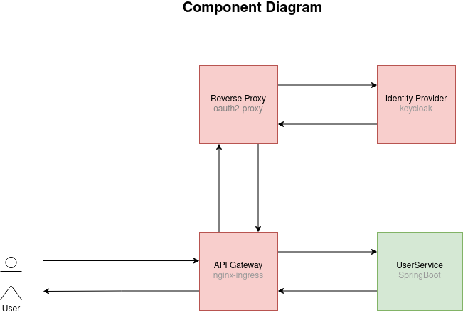
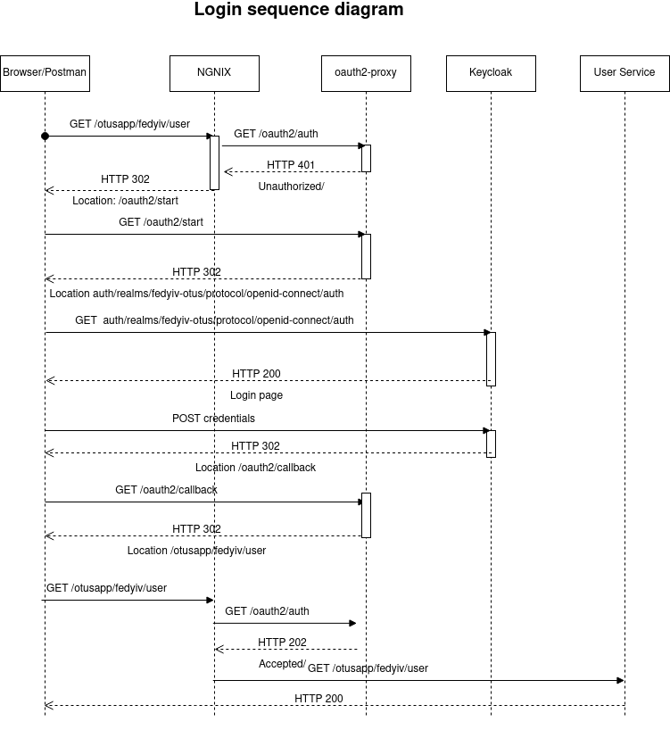

# Solution architecture



# Ingress
```shell script
kubectl config set-context --current --namespace=default
minikube addons disable ingress
helm repo add ingress-nginx https://kubernetes.github.io/ingress-nginx
helm repo update
helm install nginx ingress-nginx/ingress-nginx -f nginx-ingress.yaml --atomic
```
# Monitoring setup - SKIP THIS SECTION
```shell script

kubectl create namespace monitoring
kubectl config set-context --current --namespace=monitoring
helm repo add prometheus-community https://prometheus-community.github.io/helm-charts
helm repo add stable https://charts.helm.sh/stable
helm install prom prometheus-community/kube-prometheus-stack -f prometheus.yaml --atomic
helm install prom-postgres-exporter prometheus-community/prometheus-postgres-exporter
kubectl config set-context --current --namespace=default
helm repo add bitnami https://charts.bitnami.com/bitnami
kubectl config set-context --current --namespace=default
#View Grafana
kubectl port-forward service/prom-grafana 9000:80
#View Prometheus
kubectl port-forward service/prom-kube-prometheus-stack-prometheus 9090
```
# Auth system and keycloak setup
```shell script
kubectl config set-context --current --namespace=default
helm repo add bitnami https://charts.bitnami.com/bitnami
helm install keycloak bitnami/keycloak -f keycloak.yaml

kubectl apply -f oauth2-proxy/oauth-proxy.yaml 
kubectl apply -f oauth2-proxy/oauth-ingress.yaml

#import keycloak realm
# Important! Wait until keycloak initializes. And then proceed further
./import_keycloak_configuration.sh 
```

# Installation of the app
```shell script
kubectl config set-context --current --namespace=default
helm dependency update ./fedyiv-otus-hw6-chart
helm install myapp fedyiv-otus-hw6-chart/

```
# Testing
```bash
newman run -k TestScenarioHomeWork6.postman_collection.json
```
